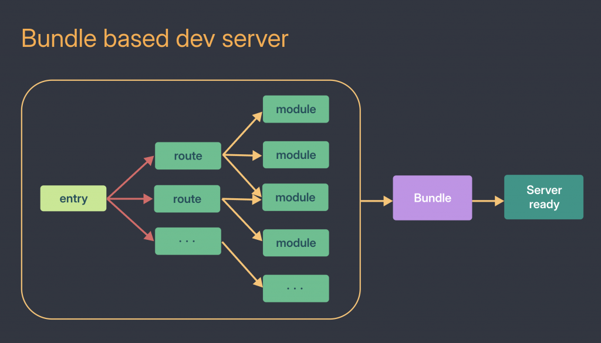
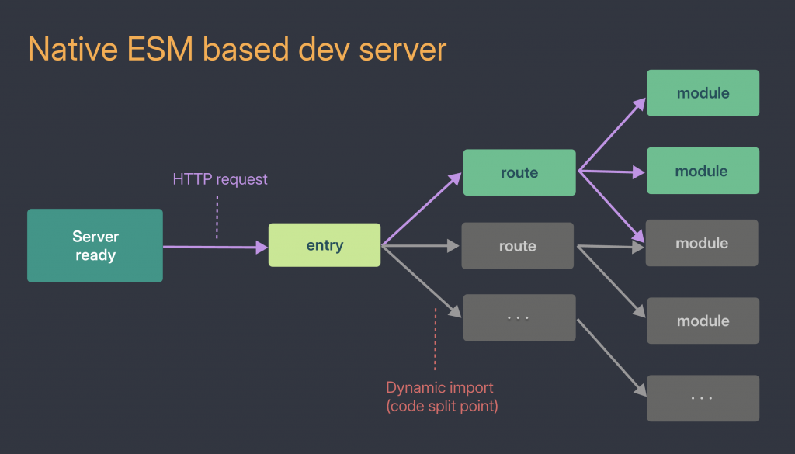

---
# You can also start simply with 'default'
theme: seriph
# random image from a curated Unsplash collection by Anthony
# like them? see https://unsplash.com/collections/94734566/slidev
background: https://cover.sli.dev
# some information about your slides (markdown enabled)
title: 前端模組化、NodeJS 與 ViteJS
info: |
  ## 前端模組化與 bundler 導入計畫
  Presentation for developers.

# apply unocss classes to the current slide
class: text-center
# https://sli.dev/features/drawing
drawings:
  persist: false
# slide transition: https://sli.dev/guide/animations.html#slide-transitions
transition: slide-left
# enable MDC Syntax: https://sli.dev/features/mdc
mdc: true
fonts:
  # basically the text
  sans: Robot
  # use with `font-serif` css class from UnoCSS
  serif: Robot Slab
  # for code blocks, inline code, etc.
  mono: Fira Code
---

# 前端模組化與打包工具
<h3 style="font-size: 1.5em; color:rgb(167, 167, 167);">ES modules、NodeJS 與 ViteJS</h3>

<div @click="$slidev.nav.next" class="mt-12 py-1" hover:bg="white op-10">
  Let's Go! <carbon:arrow-right />
</div>

<div class="abs-br m-6 text-xl">
  <button @click="$slidev.nav.openInEditor" title="Open in Editor" class="slidev-icon-btn">
    <carbon:edit />
  </button>
  <a href="https://github.com/davelin18yufan/ESM_Vite_slide" target="_blank" class="slidev-icon-btn">
    <carbon:logo-github />
  </a>
</div>

<!--
The last comment block of each slide will be treated as slide notes. It will be visible and editable in Presenter Mode along with the slide. [Read more in the docs](https://sli.dev/guide/syntax.html#notes)
-->

---
transition: fade-out
---

## 小龍的維護惡夢：剝洋蔥式 Debug

### 「這個 function 到底從哪裡來？」

小龍接到一個兩年前寫的維護案，問題簡單。但當他打開專案，卻發現自己像是在剝洋蔥，每一層都在流眼淚。

<div class="grid grid-cols-3 gap-3">

  <div class="flex items-center space-x-4 my-3">
    <CirclePercentage :percentage="20" :size="100" :stroke-width="8" />
    <div>
      <div class="font-bold text-rose-500">引入順序搞不清楚</div>
      <div class="text-gray-400 text-sm">JS -> HTML -> JS -> HTML</div>
      <div class="text-gray-600">花費總時間的 20%</div>
    </div>
  </div>

  <div class="flex items-center space-x-4 my-3">
    <CirclePercentage :percentage="30" :size="100" :stroke-width="8" />
    <div>
      <div class="font-bold text-orange-500">變數來源成謎, 註解與文件缺失</div>
      <div class="text-gray-400 text-sm">Ctrl + F 一個一個找</div>
      <div class="text-gray-600">花費總時間的 30%</div>
    </div>
  </div>

  <div class="flex items-center space-x-4 my-3">
    <CirclePercentage :percentage="40" :size="100" :stroke-width="8" />
    <div>
      <div class="font-bold text-yellow-500">引入順序檢查</div>
      <div class="text-gray-400 text-sm">Ctrl + F * N</div>
      <div class="text-gray-600">花費總時間的 40%</div>
    </div>
  </div>

</div>

<div class="italic text-gray-400 border-l-4 border-gray-300 pl-4 my-1">
  小龍深深嘆了口氣：「如果當初有模組化架構，我就不用這樣找一整天了。」
</div>

</br>
<div v-motion
  v-click
  :initial="{ y: 200, opacity: 0, scale: 0 }"
  :click-1="{ x: 0, opacity: 100, y:-180, scale: 1  }"
  :leave="{ y: 0, x: 80 }"> 

```html
  <!-- _Layout.cshtml -->
    <!-- CSS -->
    <link href="~/CssPage/Main/uploadFile.css" rel="stylesheet" />
    <link href="~/CssPage/Group/layout.css" rel="stylesheet" />
    <!-- JS -->
    <script type="text/javascript" src="~/JsPage/Models/TM_AttFile_Attachment.js"></script>
    <script src="~/Template/Hyper_Red/js/app.es5.min.js"></script>
  <!-- _PartialHeader.cshtml -->
    <!-- CSS -->
    <link href="~/Template/Hyper_Red/css/vendor/dataTables.bootstrap4.css" rel="stylesheet" />
    <!-- JS -->
    <script src="~/JsPage/Group/G001/Header.js"></script>
  <!-- _PartialMain.cshtml -->
    <!-- CSS -->
    <link href="~/CssPage/Main/uploadFile.css" rel="stylesheet" />
    <!-- JS -->
    <script src="~/Template/Hyper_Red/js/vendor/jquery.dataTables.min.js"></script>
    <script>
      var pageName = "What's up"
    </script>

```
 </div>

---
transition: fade-out
---

<style>
h1,h2 {
  background-color: #2B90B6;
  background-image: linear-gradient(45deg,rgb(73, 197, 197) 15%,rgb(30, 117, 151) 20%);
  background-size: 100%;
  -webkit-background-clip: text;
  -moz-background-clip: text;
  -webkit-text-fill-color: transparent;
  -moz-text-fill-color: transparent;
  padding-top: 0.8rem;
  padding-bottom: 0.8rem;
}
h3, h4, h5 {
  padding-top: 0.3rem;
  padding-bottom: 0.3rem;
}

code {
  color:rgb(255, 203, 15);
}
</style>

# 前端的三大痛點

<div class="text-lg text-gray-500 italic -translate-y-4">
  從「一切正常」到「一改就炸」
</div>

<div class="h-56 relative grid grid-coloums-2">

  <div class="absolute bottom-1/3 left-1/5 transform -translate-x-1/2 translate-y-1/2 w-80 h-28 hover:z-30">
    <div class="flex items-center space-x-4 border-1 border-red-50/50 p-4 rounded-lg bg-zinc-200 shadow-lg opacity-80 hover:opacity-100 ">
      <div class="text-red-500 text-4xl">🔧</div>
      <div>
        <div class="font-bold text-red-500 text-lg">維護性危機</div>
        <div class="text-gray-600">
          - 套件相依性如同盤根錯節<br>
          - jQuery 插件順序之謎<br>
          - 「動了這裡，壞了那裡」
        </div>
      </div>
    </div>
  </div>

  <div class="absolute bottom-1/2 left-1/2 transform -translate-x-1/2 translate-y-1/2 w-80 h-28 hover:z-30">
    <div class="flex items-center space-x-4 border border-orange-50/50 p-4 rounded-lg bg-zinc-200 shadow-lg opacity-80 hover:opacity-100">
      <div class="text-orange-500 text-4xl">⚡</div>
      <div>
        <div class="font-bold text-orange-500 text-lg">效能警報</div>
        <div class="text-gray-600">
          首次載入時間過長，用戶體驗直直落
        </div>
      </div>
    </div>
  </div>

  <div class="absolute bottom-2/3 left-4/5 transform -translate-x-1/2 translate-y-1/2  w-80 h-28 hover:z-30">
    <div class="flex items-center space-x-4 border border-yellow-50/50 p-4 rounded-lg bg-zinc-200 shadow-lg opacity-80 hover:opacity-100">
      <div class="text-yellow-600 text-4xl">👥</div>
      <div>
        <div class="font-bold text-yellow-600 text-lg">團隊協作障礙</div>
        <div class="text-gray-600">
          程式碼重複性高、衝突頻傳，開發效率大打折扣
        </div>
      </div>
    </div>
  </div>

  <div 
    class="w-80 h-28 z-30" 
    v-motion 
    v-click="2"   
    :initial="{ x: -200, opacity: 0, scale: 0 }"
    :click-1="{ x: 50, opacity: 100, scale: 1  }"
  >
    <div class="flex items-center space-x-4 border border-yellow-50/50 p-4 rounded-lg bg-slate-200 shadow-lg">
      <div class="text-teal-600 text-4xl">📦</div>
      <div>
        <div class="font-bold text-teal-600 text-lg">套件版本管理</div>
        <div class="text-gray-600">
          控管不易，更新繁瑣
        </div>
      </div>
    </div>
  </div>

  <div 
    class="w-80 h-28 z-30" 
    v-motion 
    v-click="3"   
    :initial="{ x: -200, opacity: 0, scale: 0 }"
    :click-1="{ x: 50, opacity: 100, scale: 1  }"
  >
    <div class="flex items-center space-x-4 border border-yellow-50/50 p-4 rounded-lg bg-slate-200 shadow-lg">
      <div class="text-yellow-600 text-4xl">⚙️</div>     
      <div>
        <div class="font-bold text-purple-600 text-lg">設定檔無系統</div>
        <div class="text-gray-600">
          翻舊專案複製貼上設定
        </div>
      </div>
    </div>
  </div>

  <div 
    class="w-80 h-28 z-30 col-start-2" 
    v-motion 
    v-click="4"   
    :initial="{ x: -200, opacity: 0, scale: 0 }"
    :click-1="{ x: -100, opacity: 100, scale: 1  }"
  >
    <div class="flex items-center space-x-4 border border-yellow-50/50 p-4 rounded-lg bg-slate-200 shadow-lg">
      <div class="text-sky-600 text-4xl">🤖</div>     
      <div>
        <div class="font-bold text-sky-600 text-lg">無法自動化</div>
        <div class="text-gray-600">
          無法將重複一致的動作自動化處理
        </div>
      </div>
    </div>
  </div>

</div>

<div v-motion
  v-click
  :initial="{ x: 100, opacity: 0 }"
  :click-1="{ x: 0, opacity: 100  }"
  :leave="{ y: 0, x: 80 }"> 

  ```html
      <!-- _Layout.cshtml -->
      <script src="~/Template/Hyper_Red/js/app.es5.min.js"></script>

      <!-- The file you intend to use -->
      <script src="~/JsPage/Group/G001/THomeworkEdit.js?v=@eLearningWeb.AppConfig.Version"></script>
      <!-- SomeFile.cshtml -->
      <script src="~/Template/Hyper_Red/js/vendor/dropzone.min.js"></script>
      <script src="~/Template/Hyper_Red/js/ui/component.fileupload.js?v=@eLearningWeb.AppConfig.Version"></script>

  ```
</div> 

---
transition: slide-left
layout: image
image: https://images.unsplash.com/photo-1526566661780-1a67ea3c863e?q=80&w=1769&auto=format&fit=crop&ixlib=rb-4.0.3&ixid=M3wxMjA3fDB8MHxwaG90by1wYWdlfHx8fGVufDB8fHx8fA%3D%3D
class: place-content-center
---

<h1 class="text-center" v-motion :initial="{ y: -50, opacity: 0 }" :enter="{ y: 0, opacity: 1 }" style="transition: all 1.2s ease;">Import/export solves all.</h1>

---
transition: slide-up
level: 2
layout: two-cols
---

## 模組化大躍進：從手動排序到自行組織

<div class="relative overflow-hidden mr-2">
  <div class="absolute top-0 left-0 w-2 h-full bg-gradient-to-b from-gray-300 via-blue-400 to-green-500 rounded-full"></div>

  <div class="space-y-1 pl-4">
    <div class="bg-gray-100 border-1 border-sky-50 p-4 rounded-lg">
      <div class="text-gray-400 font-bold">傳統</div>
      <div class="text-gray-600">手動 script 標籤</div>
    </div>
    <div class="bg-gray-100 border-1 border-amber-50 p-4 rounded-lg">
      <div class="text-blue-400 font-bold">進化時期</div>
      <div class="text-gray-600">CommonJS：<span v-mark.circle.orange="1">同步</span>，適用後端，但瀏覽器需打包工具</div>
    </div>
    <div class="bg-gray-100 border-1 border-rose-50 p-4 rounded-lg">
      <div class="text-green-500 font-bold">現代標準</div>
      <div class="text-gray-600">ES Modules：原生支持，支援
        <span v-mark.circle.orange="1">非同步</span>，結構簡單。
      </div>
    </div>
  </div>
</div>

<div 
  class="bg-green-50 p-6 rounded-lg border-2 border-green-200" 
  v-motion 
  v-click="5"
  :initial="{ y: 0, opacity: 0 }" 
  :enter="{ y: -100, opacity: 1 }"
>
  <div class="text-lg font-bold text-green-700 mb-4">🌟 ESM 革新優勢</div>
  <div class="space-y-3">
    <div class="flex items-center space-x-2">
      <div class="text-rose-500">✓</div>
      <div class="text-teal-700">原生支援：無需額外轉譯工具</div>
    </div>
    <div class="flex items-center space-x-2">
      <div class="text-rose-500">✓</div>
      <div class="text-teal-700">靜態分析：編譯時即可優化依賴</div>
    </div>
    <div class="flex items-center space-x-2">
      <div class="text-rose-500">✓</div>
      <div class="text-teal-700">異步載入：提升應用性能</div>
    </div>
  </div>
</div>

:: right ::

<div class="grid grid-cols-3 gap-2 mt-2" v-click="5" v-motion  
  :initial="{ scale: 0, opacity: 0.5 }" 
  :enter="{ scale: 1, opacity: 1 }"
>

  <div class="flex flex-col items-center space-y-2">
    <carbon:arrow-up class="text-4xl text-cyan-500" />
    <div class="font-bold text-cyan-400">可讀性,可維護性</div>
  </div>

  <div class="flex flex-col items-center space-y-2">
    <carbon:arrow-down class="text-4xl text-emerald-500" />
    <div class="font-bold text-emerald-400">程式碼耦合</div>
  </div>

  <div class="flex flex-col items-center space-y-2">
    <carbon:close class="text-4xl text-amber-500" />
    <div class="font-bold text-amber-400">順序不再重要</div>
  </div>

</div>

<div v-click
  v-motion  
  :initial="{ scale: 0, opacity: 0.5 }" 
  :enter="{ scale: 1, opacity: 1 }"
>

```html
<script scr="path/to/your/file" type="module"></script>
```
</div>


````md magic-move {lines: true}

```javascript {*|8-14|*}

// module.js
const greeting = 'Hello world';

function add(a, b) {
  return a + b;
}

module.exports = {
  greeting: greeting,
  add: add
};

// main.js
const myModule = require('./module');

console.log(myModule.greeting); // Hello world
console.log(myModule.add(2, 3)); // 5
```

```javascript
// module.js
import $ from 'jquery';
import Dropzone from 'dropzone';

const myDropzone = new Dropzone('#my-dropzone');

export myDropzone;

// main.js
import { myDropzone } from "./module.js";
myDropzone.processFile();

```
```` 


---
transition: slide-left
---


## 模組化重構：從混亂到條理分明

<div class="grid grid-cols-3 gap-4 mb-4">
<div class="bg-blue-100 p-4 rounded-lg border-l-4 border-blue-500">
    <div class="flex items-center space-x-3 mb-3 text-sky-800">
      <div class="text-3xl">🎯</div>
      <div class="font-bold text-lg">單一入口原則</div>
    </div>
    <div class="pl-4 space-y-2">
      <div class="flex items-center space-x-2">
        <div class="text-green-500 text-lg">✓</div>
        <div class="text-blue-800">依賴關係明確</div>
      </div>
      <div class="flex items-center space-x-2">
        <div class="text-green-500 text-lg">✓</div>
        <div class="text-blue-800">自動追蹤引入記錄</div>
      </div>
    </div>
  </div>

  <div class="bg-purple-100 p-4 rounded-lg border-l-4 border-purple-500">
    <div class="flex items-center space-x-3 mb-3 text-indigo-800">
      <div class="text-3xl">🔄</div>
      <div class="font-bold text-lg">複用率提升</div>
    </div>
    <div class="pl-4">
      <div class="flex items-center text-purple-800">
        <div class="font-bold text-4xl p-2">80%</div>
        <div class="text-sm text-gray-600">的程式可以重複使用</div>
      </div>
    </div>
  </div>

  <div class="bg-green-100 p-4 rounded-lg border-l-4 border-green-500">
    <div class="flex items-center space-x-3 mb-3">
      <div class="text-3xl">📦</div>
      <div class="font-bold text-lg text-teal-800">完整開發資訊</div>
    </div>
    <div class="pl-4 space-y-2 text-emerald-800" >
      <div class="flex items-center space-x-2">
        <div class="text-green-500 text-lg">✓</div>
        <div>JSDoc 註解保留</div>
      </div>
      <div class="flex items-center space-x-2">
        <div class="text-green-500 text-lg">✓</div>
      <div>TypeScript 型別支援</div>
      </div>
    </div>
  </div>
</div>

<v-click>

````md magic-move {lines: true}

```javascript {1-5|7-12|*} 
  // A.js
  const privateVar = 'I am in A.js';
  /** some comment */
  export function showVar() {
    console.log(privateVar); 
  }

  // B.js
  import { showVar } from "A.js";
  const privateVar = 'I am in B.js'
  showVar(); // 'I am in A.js' 如果hover會得到'some comment'
  console.log(privateVar); // 'I am in B.js'
```

````
</v-click>

<v-click>
  <p class="text-center"><span class="italic text-gray-400 mr-2">現在小龍可以把多出的時間拿來泡咖啡了!</span>😊</p>
</v-click>

---
transition: slide-up
---

**動態載入**：ESM <span class="text-green-400">原生支援</span>動態加載，只載入實際需要的部分，提升性能。
  1. **完整加載**

````md magic-move {lines: true}

```javascript
// <script src="./module.js"></script> 使用傳統 HTML 載入

largeFunction.smallFunction();
```

```javascript
// CommonJS
const largeFunction = require("./module.js");

largeFunction.smallFunction();
```

````

  2. **動態加載**: <v-click><span v-mark.red="2" class="ml-1 text-base text-amber-400">只載入會被使用到的部分，維護程式隱蔽性、減少不必要效能使用、減少記憶體使用</span></v-click>

  ```javascript
  import('./module.js').then(({ smallFunction }) => {
    smallFunction();
  }); 
  ```
  
**打包編譯工具**：打包工具如 <span class="text-green-400">Vite 、 Webpack 、 Rspack</span> 等工具會自動解析依賴，優化資源分配。

<div v-motion
  v-click
  :initial="{ scale: 0, opacity: 0 }"
  :enter="{ scale: 1, opacity: 100  }"
  class="mt-3">


</div>

---
transition: slide-down
---

## 新舊模組系統的相容性問題

<div>

  <div class="relative bg-red-50 p-6 rounded-lg mb-1">
    <div class="absolute -top-4 -left-4 bg-red-500 text-white p-3 rounded-full">
      ⚠️
    </div>
    <div class="ml-8">
<div class="font-bold text-lg text-red-700 mb-2">兩者的模組系統不同，某些套件在轉換過程中可能會出現問題</div>
<div class="space-y-1 text-gray-600">

````md magic-move {lines: true}

```bash
Error: Dynamic require of "<module_name>" is not supported
```

```bash
Error [ERR_REQUIRE_ESM]: require() of ES Module (...) from (...) not supported.
Instead change the require of (...) in (...) to a dynamic import() which is available in all CommonJS modules.
```
````
</div>

</div>
  </div>

  <div class="relative bg-yellow-50 p-6 rounded-lg">
    <div class="absolute -top-4 -left-4 bg-yellow-500 text-white p-3 rounded-full">
      🔄
    </div>
    <div class="ml-8">
      <div class="font-bold text-lg text-yellow-700 mb-2">動態加載限制</div>
      <div class="text-gray-600">
        <code>import()</code> 動態引入在某些環境中不受支援，需要替代方案
      </div>
    </div>
  </div>

  </div>

  <div class="flex items-center justify-center">
    <div class="relative size-64 ">
      <div class="absolute inset-0 -top-6">
        <div class="relative w-full h-full overflow-hidden">
          <div class="absolute inset-0 flex items-center justify-center">
            <div class="relative">
              <div class="absolute inset-0 flex items-center justify-center">
                <div class="w-28 h-28 rounded-full bg-blue-200 border-2 border-blue-300 flex items-center justify-center">
                  <span class="text-xs text-gray-700">ESM</span>
                </div>
              </div>
              <div class="absolute inset-0 flex items-center justify-center">
                <div class="w-16 h-16 rounded-full bg-green-200 border-2 border-green-300 flex items-center justify-center mr-30">
                  <span class="text-xs text-gray-700 text-wrap">CJS</span>
                </div>
              </div>
              <div class="w-40 h-40 rounded-full bg-red-100 border-2 border-red-300">
                <span class="text-sm text-red-700 ">
                Babel
                </span>
              </div>
            </div>
          </div>
        </div>
      </div>
    </div>
  </div>


---
transition: slide-left
---

## 銜接新舊模組系統的最佳實踐

<div class="grid grid-cols-3 gap-4 text-gray-600">

<div class="bg-blue-50 p-4 rounded-lg">
  <div class="flex items-center space-x-2 mb-4">
    <div class="text-2xl">🎯</div>
    <div class="font-bold text-blue-800">統一標準</div>
  </div>
  <div class="text-gray-600">
    <span v-mark.circle.yellow="1">避免混合使用</span> CommonJS 和 ESM，以減少兼容性問題
  </div>
</div>

<div class="bg-green-50 p-4 rounded-lg">
  <div class="flex items-center space-x-2 mb-4">
    <div class="text-2xl">🔄</div>
    <div class="font-bold text-emerald-800">轉換工具</div>
  </div>
  <div class="text-gray-600">
    使用 <code>Babel</code> 進行語法轉換，確保兼容性
  </div>
</div>

<div class="bg-purple-50 p-4 rounded-lg">
  <div class="flex items-center space-x-2 mb-4">
    <div class="text-2xl">🛠️</div>
    <div class="font-bold text-violet-800">工具鏈</div>
  </div>
  <div class="text-gray-600">
    確保打包工具完整支援目標模組系統
  </div>
</div>

<div class="bg-orange-50 p-4 rounded-lg">
  <div class="flex items-center space-x-2 mb-4">
    <div class="text-2xl">📦</div>
    <div class="font-bold text-amber-800">動態加載</div>
  </div>
  <div class="text-gray-600">
    提供 <code v-mark.circle.red="1">require()</code> 作為 <code>import()</code> 的替代方案
  </div>
</div>

<div class="bg-teal-50 p-4 rounded-lg">
  <div class="flex items-center space-x-2 mb-4">
    <div class="text-2xl">📍</div>
    <div class="font-bold text-teal-800">模組路徑</div>
  </div>
  <div class="text-gray-600">
    明確指定引入路徑，避免解析衝突
  </div>
</div>

<div class="bg-gray-50 p-4 rounded-lg flex items-center justify-center">
  <div class="text-center">
    <div class="text-4xl mb-2">💡</div>
    <div class="text-gray-600 font-bold">更多最佳實踐...</div>
  </div>
</div>

</div>

<!-- - 統一模組系統：
  - 儘量在項目中統一使用一種模組系統，<span v-mark.circle.yellow="1">避免混合使用</span> CommonJS 和 ESM，以減少兼容性問題。

- **使用轉換工具**：
  - <span v-mark.red="2">使用 `Babel` 等轉換工具將 ESM 代碼轉換為 CommonJS</span>，或反之，確保在所有環境中都能正常運行。

- 檢查工具鏈支持：
  - 在使用 ESM 時，確保所使用的打包工具和編譯器對 ESM 的支持完善，避免因工具鏈問題導致的錯誤。

- **動態加載替代方案**：
  - 在不支持 ESM 動態加載的環境中，考慮使用其他方式實現動態加載，如使用 CommonJS 的 `require()`。

- 明確模組路徑：
  - 在引用模組時，明確指定模組的路徑，避免因模組解析行為不同導致的錯誤。 -->


---
transition: fade
layout: image
image: https://images.unsplash.com/photo-1549088521-94b6502fec3d?q=80&w=1632&auto=format&fit=crop&ixlib=rb-4.0.3&ixid=M3wxMjA3fDB8MHxwaG90by1wYWdlfHx8fGVufDB8fHx8fA%3D%3D
---


<div class="grid grid-cols-2 gap-3">
  <div class="bg-gray-900 text-white p-6 rounded-xl shadow-lg">
    <h3 class="text-yellow-400 text-xl font-bold">🖥️ 跨平台環境</h3>
    <p>Node.js是個提供 跨平台的<span v-mark.circle.yellow="1"> Runtime</span>，讓 JavaScript 可以在<span v-mark.red="1">伺服器端</span>高效執行。</p>
  </div>

  <div class="bg-gray-900 text-white p-6 rounded-xl shadow-lg">
    <h3 class="text-blue-400 text-xl font-bold">📦 強大的模組管理</h3>
    <p>使用 <span class="text-green-400">NPM、Yarn、PNPM、Vlt</span>，簡化套件管理，擁有全球最大開源生態系統。</p>
  </div>

  <div class="bg-gray-900 text-white p-6 rounded-xl shadow-lg">
    <h3 class="text-red-400 text-xl font-bold">⚡ 非阻塞 I/O</h3>
    <p>透過 <span class="text-yellow-400" v-mark.red="2">事件驅動</span> 和 <span class="text-yellow-400" v-mark.circle.yellow="2">非阻塞</span> 模型，高效處理並發請求。</p>
  </div>

  <div class="bg-gray-900 text-white p-6 rounded-xl shadow-lg">
    <h3 class="text-purple-400 text-xl font-bold">🔧 更靈活的執行環境</h3>
    <p>不受限於瀏覽器，可運行於 <span class="text-green-400">伺服器、桌面、IoT 設備</span>。</p>
  </div>
</div>

<!-- - **跨平台環境**：Node.js 提供了一個<span v-mark.circle.yellow="1">跨平台</span>的<span v-mark.red="1">Runtime</span>，使得 JavaScript 可以在伺服器端高效執行。等同開發者可以使用同一種語言在<span v-mark.red="1">前端和後端</span>進行開發，減少了學習成本和開發時間。
- **模組管理**：Node.js 通過 [NPM（Node Package Manager）](https://www.npmjs.com/) 簡化了第三方庫的管理。NPM 是世界上最大的套件管理庫，提供了數百萬個開源庫，開發者可以輕鬆地搜索、安裝和管理這些庫，從而加速開發過程並提高代碼質量。
- **非阻塞 I/O**：Node.js 採用<span v-mark.red="2">事件驅動和非阻塞 I/O 模型</span>，使其在<span v-mark.circle.yellow="2">處理大量並發連接</span>時具有高效能。這使得 Node.js 非常適合用於 I/O 密集型應用，如 Web 服務和即時應用。
- **豐富的生態系統**：除了 NPM 提供的第三方庫，Node.js 還有許多常見的框架和工具，如 `Express.js`、`Koa.js` 和 `NestJS`..，這些工具和框架進一步簡化了開發過程，並提供了強大的功能和靈活性。
- **更靈活的執行環境運用** : 因為Node.Js不會只侷限於在瀏覽器上才能執行，因此創造了更廣大的應用可能性，例如不必到client端才開始執行JS，可以更快速有效率的運算跟渲染、控管自己的環境變數、 -->

<div v-click="3">

```bash
npm install jquery
yarn add jquery
pnpm add jquery
```

</div>

---
transition: fade
layout: image-right
image: ./assets/trend.png
backgroundSize: contain
---

## Node.s 2024一些可以說嘴的統計數據

<div class="text-xl text-gray-600 italic mb-6">
  <svg viewBox="0 0 1500 1500" class="w-full h-full">

  <image 
    href="https://images.unsplash.com/photo-1451187580459-43490279c0fa?q=80&w=1772&auto=format&fit=crop&ixlib=rb-4.0.3&ixid=M3wxMjA3fDB8MHxwaG90by1wYWdlfHx8fGVufDB8fHx8fA%3D%3D"
    width="1500" 
    height="1500"
    preserveAspectRatio="xMidYMid slice"
    class="opacity-50"
  />
  
  <g transform="translate(410,1010)">
    <circle cx="0" cy="0" r="20" fill="#3B82F6" class="animate-pulse"/>
    <text x="40" y="40" fill="white" font-size="14" class="animate-laser" style="animation-duration:800ms">50-60% 加載時間優化</text>
  </g>

  <g transform="translate(500,650)">
    <circle cx="0" cy="0" r="20" fill="#10B981" class="animate-pulse"/>
    <text x="40" y="40" fill="white" font-size="14" class="animate-laser" style="animation-duration:900ms">58% 開發成本降低</text>
  </g>
  
  <g transform="translate(900,450)">
    <circle cx="0" cy="0" r="20" fill="#F59E0B" class="animate-pulse"/>
    <text x="40" y="40" fill="white" font-size="14" class="animate-laser" style="animation-duration:1s">86% 搭配框架使用</text>
  </g>
  
  <g transform="translate(640,850)">
    <circle cx="0" cy="0" r="20" fill="#EC4899" class="animate-pulse"/>
    <text x="40" y="40" fill="white" font-size="14" class="animate-laser" style="animation-duration:1.1s">95% 搭配使用 DB</text>
  </g>
  
  <g transform="translate(100,750)">
    <circle cx="0" cy="0" r="20" fill="#8B5CF6" class="animate-pulse"/>
    <text x="40" y="40" fill="white" font-size="14" class="animate-laser" style="animation-duration:1.2s">46% 開發者介於25-35歲</text>
  </g>

  <g transform="translate(190,1210)">
    <circle cx="0" cy="0" r="20" fill="#90AAC9" class="animate-pulse"/>
    <text x="40" y="40" fill="white" font-size="14" class="animate-laser" style="animation-duration:1.3s">36.42% 使用延伸相關工具</text>
  </g>

  <g transform="translate(1190,940)">
    <circle cx="0" cy="0" r="20" fill="#32CD32" class="animate-pulse"/>
    <text x="-40" y="75" fill="white" font-size="14" class="animate-laser" style="animation-duration:1.4s">49.4% </text>
    <text x="-75" y="130" fill="white" font-size="14" class="animate-laser" style="animation-duration:1.4s">使用在商業區域</text>
  </g>

   <g transform="translate(530,1390)"  >
    <circle cx="0" cy="0" r="20" fill="#904449" class="animate-pulse "/>
    <text x="40" y="40" fill="white" font-size="14" class="animate-laser" style="animation-duration:1.5s">Twitter、Netflix、GitHub、Spotify、</text>
    <text x="40" y="90" fill="white" font-size="14" class="animate-laser" style="animation-duration:1.5s">Adobe 等知名網站選用</text>
  </g>
</svg>
</div>

<style>
@keyframes laserPulse {
  0% {
    transform: scale(1);
    transform: translateY(-200%);
    opacity: 0;
  }
  50% {
    transform: scale(1);
    transform: translateY(-100%);
    opacity: 0.5;
  }
  100% {
    transform: scale(1);
    transform: translateY(0);
    opacity: 1;
  }
}


.animate-laser {
  animation: laserPulse 1s 200ms forwards;
}

</style>

---
transition: slide-down
layout: two-cols-header
class: gap-2
---

## 簡單介紹 NPM

:: left ::

#### 管理dependencies

- 安裝單一套件：

  ```bash
  npm install <package-name>
  ```

- 安裝特定版本的套件：

  ```bash
  npm install <package-name>@<version>
  ```

- 安裝開發套件：

  ```bash
  npm install <package-name> --save-dev
  ```

:: right ::

#### package.json 管理腳本

````md magic-move {lines: true}

```json {*|1-5|6-11|12-17}
{
  "name": "my-project", 
  "version": "1.0.0",
  "description": "A simple project",
  "main": "index.js",
  "scripts": {               // 定義執行腳本快捷
    "start": "node index.js",
    "test": "jest",
    "build": "dotnet build",
    "run": "dotnet run"
  },
  "dependencies": {          // 公開套件
    "dotnet": "^4.17.1"
  },
  "devDependencies": {       // 開發人員套件
    "jest": "^26.6.3"
  }
}
```
````
---
transition: fade-out
layout: image
image: https://images.unsplash.com/photo-1483356256511-b48749959172?q=80&w=1770&auto=format&fit=crop&ixlib=rb-4.0.3&ixid=M3wxMjA3fDB8MHxwaG90by1wYWdlfHx8fGVufDB8fHx8fA%3D%3D
---


# ViteJS

<div class="grid grid-cols-3 gap-2">
  <div class="bg-gray-900 text-white py-3 px-4 rounded-xl shadow-lg flex flex-col items-center ">
    <h4 class="text-yellow-400 text-xl font-bold">⚡ 極速冷啟動</h4>
    <p class="text-sm">Vite 透過 <span class="text-green-400">原生 ES Modules</span>，冷啟動比傳統工具快<span class="text-cyan-200 font-bold" v-mark.circle.orange="1"> 10 </span>倍！</p>
  </div>

  <div class="bg-gray-900 text-white py-3 px-4 rounded-xl shadow-lg flex flex-col items-center">
    <h4 class="text-blue-400 text-xl font-bold">🔄 HMR 即時熱更新</h4>
    <p class="text-sm">代碼變更<span v-mark.circle.yellow="1">即時</span>生效，開發過程 <span class="text-green-400" >無需重新整理</span> 頁面。</p>
  </div>

  <div class="bg-gray-900 text-white py-3 px-4 rounded-xl shadow-lg flex flex-col items-center">
    <h4 class="text-red-400 text-xl font-bold">🌳 Tree Shaking</h4>
    <p class="text-sm">內建 <span class="text-yellow-400" v-mark.red="1">Tree Shaking & Minify</span>，僅保留必要代碼，優化效能。</p>
  </div>

  <div class="bg-gray-900 text-white py-3 px-4 rounded-xl shadow-lg flex flex-col items-center">
    <h4 class="text-purple-400 text-xl font-bold">🔌 豐富插件生態</h4>
    <p class="text-sm">支援多種插件，幾乎有在更新的框架套件都有被加入，讓開發更順手。</p>
  </div>

  <div class="bg-gray-900 text-white py-3 px-4 rounded-xl shadow-lg flex flex-col items-center">
    <h4 class="text-green-400 text-xl font-bold">📣 打包編譯一打十</h4>
    <p class="text-sm">Vite整合了 transpiler, <span class="text-green-400">bundler (Rollup, esbuild)</span>, <span class="text-green-400 ml-1" v-mark.red="1">build tool (Vite)</span> 為一體，一套就做到好。</p>
  </div>

  <div class="bg-gray-900 text-white py-3 px-4 rounded-xl shadow-lg flex flex-col items-center">
    <h4 class="text-cyan-400 text-xl font-bold">🌍 跨平台支持</h4>
    <p class="text-sm"><span v-mark.red="1">支援多種操作系統</span> & 瀏覽器，開發環境無縫切換。</p>
  </div>
</div>

<!-- - **快速冷啟動**：<span v-mark.red="1">原生 ES Modules 支持，無需預編譯</span>，冷啟動速度極快。
- **HMR 支持**：即時程式碼更新，開發過程中無需刷新頁面即可看到變更。
- **資源優化**：內置 <span v-mark.circle.yellow="1">Tree Shaking</span> 和 <span v-mark.circle.yellow="1">Minify</span>，僅保留必要代碼，減少文件大小，提升加載速度。
- **豐富插件生態**：支持多種插件，擴展功能靈活。
- **友好的開發體驗**：提供詳細的錯誤提示和快速的反饋循環。
- **靈活配置**：支持自定義配置，滿足不同項目的需求。
- **跨平台支持**：兼容多種操作系統和瀏覽器，開發環境無縫切換。 -->

<div 
  v-click="2"
  v-motion
  :initial="{ y: 100 }"
  :enter="{y: 10 }">

</div>

<div 
  v-click="3"
  v-motion
  :initial="{ scale: 0, opacity: 0 }"
  :enter="{ scale: 1, y: 420, opacity: 100 }"
  class="absolute inset-0 size-full duration-400">

</div>


---
transition: fade-out
layout: two-cols-header
---

# 告別傳統打包時代！

### Vite 的開發伺服器使用了 <span class="text-green-400" v-mark.red>Native-ESM 架構</span>
### 不再依賴繁瑣的 Bundle-based 處理流程！

:: left ::

<div 
  v-click
  v-motion
  :initial="{ x: -50 }"
  :enter="{ x: 0, y: -50 }"
  :leave="{ x: 50 }"
  >
  
</div>

:: right ::

<div 
  v-click
  v-motion
  :initial="{ x: -50 }"
  :enter="{ x: 10, y: -50 }"
  :leave="{ x: 50 }"
  >
  
</div>

---
transition: fade-out
--- 

## Bundle 的 Magic
<div v-after>
  <h4>經由 <span class="text-green-400">entry point</span>, Vite會藉由<span v-mark.circle.orange="1" >入口點</span>一路往下找去做<span v-mark.red="1" class="text-amber-400"> bundle, minify, transpile </span></h4>
</div>

<div v-click="2" class="text-gray-500 italic">
  只要在開發過程保持檔案結構，並不會影響開發流程，就會自動將靜態檔案全部打包並處理。
</div>

````md magic-move {lines: true}

```plaintext {*|12}
# 未經優化的輸出
project/
├── Controllers/
│   ├── HomeController.cs
│   └── ApiController.cs
├── Views/
│   ├── Home/
│   │   └── Index.cshtml
│   └── Shared/
│       └── _Layout.cshtml
├── JsPage/
│   ├── app.js            // entry point
│   └── layout.js
├── CssPage/
│   └── css/
│       └── layout.css
└── bin/
  └── Debug/
    └── net4.8/
      └── web.dll
```

```plaintext {*|6-7}
# 經過 Vite 打包的輸出
project/
├── dist/
│   ├── js/
│   │   └── app.js 
│   └── css/
│       └── styles.css
└── bin/
  └── Release/
    └── net4.8/
      └── web.dll
```
````


<v-click>

````md magic-move {lines: true}
```html
<!-- 原本的引入方式 -->
<link rel="stylesheet" href="styles.css">
```

```javascript
// app.js
import './styles.css';

```

```bash
# 開發環境
npm run dev

# 生產環境
npm run build
```
````
</v-click>

---
transiton: fade-out
layout: center
class: text-center
---

# Netflix 等級的 Node.Js 紀錄片
<Youtube id="LB8KwiiUGy0" width="800" height="400"/>

---
layout: center
class: text-center
--- 

# 謝謝聆聽

[References](https://ithelp.ithome.com.tw/users/20169399/ironman/8023) · [GitHub](https://github.com/davelin18yufan/ESM_Vite_slide) · [Showcases](https://sli.dev/resources/showcases)

<PoweredBySlidev mt-10 />
