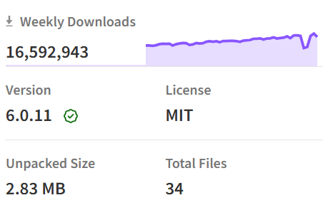

---
# You can also start simply with 'default'
theme: seriph
# random image from a curated Unsplash collection by Anthony
# like them? see https://unsplash.com/collections/94734566/slidev
background: https://cover.sli.dev
# some information about your slides (markdown enabled)
title: 前端模組化、NodeJS 與 ViteJS
info: |
  ## 前端模組化與 Vite 引入計畫
  Presentation for developers.

  Learn more at [Sli.dev](https://sli.dev)
# apply unocss classes to the current slide
class: text-center
# https://sli.dev/features/drawing
drawings:
  persist: false
# slide transition: https://sli.dev/guide/animations.html#slide-transitions
transition: slide-left
# enable MDC Syntax: https://sli.dev/features/mdc
mdc: true
---

# 前端模組化與打包工具
<h3 style="font-size: 1.5em; color:rgb(167, 167, 167);">ES modules、NodeJS 與 ViteJS</h3>

<div @click="$slidev.nav.next" class="mt-12 py-1" hover:bg="white op-10">
  Let's Go! <carbon:arrow-right />
</div>

<div class="abs-br m-6 text-xl">
  <button @click="$slidev.nav.openInEditor" title="Open in Editor" class="slidev-icon-btn">
    <carbon:edit />
  </button>
  <a href="https://github.com/davelin18yufan/ESM_Vite_slide" target="_blank" class="slidev-icon-btn">
    <carbon:logo-github />
  </a>
</div>

<!--
The last comment block of each slide will be treated as slide notes. It will be visible and editable in Presenter Mode along with the slide. [Read more in the docs](https://sli.dev/guide/syntax.html#notes)
-->

---
transition: fade-out
---

# 現狀分析與痛點

### 現行開發方式問題

目前，我們的開發方式基於傳統的 .NET MPA (Multi-Page Application)，使用 HTML 中的 `<script>` 和 `<link>` 引入 JavaScript 和 CSS 文件。
</br>
<div v-motion
  v-click
  :initial="{ x: 100, opacity: 0 }"
  :click-1="{ x: 0, opacity: 100  }"
  :leave="{ y: 0, x: 80 }"> 

```html
  <!-- _Layout.cshtml -->
    <!-- CSS -->
    <link href="~/CssPage/Main/uploadFile.css" rel="stylesheet" />
    <link href="~/CssPage/Group/layout.css" rel="stylesheet" />
    <!-- JS -->
    <script type="text/javascript" src="~/JsPage/Models/TM_AttFile_Attachment.js"></script>
    <script src="~/Template/Hyper_Red/js/app.es5.min.js"></script>
  <!-- _PartialHeader.cshtml -->
    <!-- CSS -->
    <link href="~/Template/Hyper_Red/css/vendor/dataTables.bootstrap4.css" rel="stylesheet" />
    <!-- JS -->
    <script src="~/JsPage/Group/G001/Header.js"></script>
  <!-- _PartialMain.cshtml -->
    <!-- CSS -->
    <link href="~/CssPage/Main/uploadFile.css" rel="stylesheet" />
    <!-- JS -->
    <script src="~/Template/Hyper_Red/js/vendor/jquery.dataTables.min.js"></script>

```
 </div>

---
transition: fade-out
---

<style>
h1,h2 {
  background-color: #2B90B6;
  background-image: linear-gradient(45deg, #4EC5D4 15%,rgb(30, 117, 151) 20%);
  background-size: 100%;
  -webkit-background-clip: text;
  -moz-background-clip: text;
  -webkit-text-fill-color: transparent;
  -moz-text-fill-color: transparent;
}
code {
  color:rgb(255, 203, 15);
}
</style>

## 問題分析
<br>

- **維護性問題**：
  - 隨著專案規模增大，JavaScript 和 CSS 文件數量增加，依賴關係變得複雜，難以管理。
  - 多次因為 `jQuery` 插件的引入順序錯誤導致功能失效。
  - 又或是套件跟現行程式衝突卻無從找起。
- **性能問題**：
  - 頁面首次加載需載入大量靜態資源，影響用戶體驗。
- **團隊協作問題**：
  - 由於缺乏模組化管理，協作時容易引發重複開發和代碼衝突。
<div v-motion
  v-click
  :initial="{ x: 100, opacity: 0 }"
  :click-1="{ x: 0, opacity: 100  }"
  :leave="{ y: 0, x: 80 }"> 

  ```html
      <!-- _Layout.cshtml -->
      <script src="~/Template/Hyper_Red/js/app.es5.min.js"></script>

      <!-- The file you intend to use -->
      <script src="~/JsPage/Group/G001/THomeworkEdit.js?v=@eLearningWeb.AppConfig.Version"></script>
      <!-- SomeFile.cshtml -->
      <script src="~/Template/Hyper_Red/js/vendor/dropzone.min.js"></script>
      <script src="~/Template/Hyper_Red/js/ui/component.fileupload.js?v=@eLearningWeb.AppConfig.Version"></script>

  ```
</div> 

---
transition: slide-up
level: 2
layout: two-cols
---

# 模組化技術演進與優勢

### 簡略演進史

| 時代         | 方法              | 特點與問題                 |
| ---------- | --------------- | -------------------------- |
| 傳統         | `<script>`      | 手動管理依賴，易出錯          |
| CommonJS   | `require()`     | 同步，適用後端，但瀏覽器需打包工具 |
| ES Modules | `import/export` | 原生支持，結構清晰，支援非同步      |


:: right ::

</br>

### 模組化核心目標與解決方案

1. 提升程式碼可讀性與可維護性。
2. 減少程式碼耦合，提升可重用性。
3. 解決依賴順序與重複引入問題。


````md magic-move {lines: true}

```javascript 
// module.js
const greeting = 'Hello world';

function add(a, b) {
  return a + b;
}

module.exports = {
  greeting: greeting,
  add: add
};

// main.js
const myModule = require('./module');

console.log(myModule.greeting); // Hello world
console.log(myModule.add(2, 3)); // 5
```

```javascript
// module.js
import $ from 'jquery';
import Dropzone from 'dropzone';

const myDropzone = new Dropzone('#my-dropzone');

export myDropzone;

// main.js
import { myDropzone } from "./module.js";
myDropzone.processFile();

```
```` 

---
transition: slide-left
---


## 實際解決的問題

- **單一入口**：每個模組只有一個導出入口，清楚定義依賴關係。
  - **方便複用**：模組化後的代碼可以方便地在不同項目中重用，避免重複編寫相同功能，並且一定會留下引入紀錄。
  - **完整封裝**：導出模組時，JSDoc註解和型別（TypeScript）也會一同編譯，<span v-mark.red="2">跨文件保留完整的開發訊息。</span>

- **避免命名衝突**：<span v-mark.red="2">模組化將變數封裝在模組內</span>，避免全局命名空間污染。

<v-click>

````md magic-move {lines: true}

```javascript {1-5|7-12|*} 
  // A.js
  const privateVar = 'I am in A.js';
  /** some comment */
  export function showVar() {
    console.log(privateVar); 
  }

  // B.js
  import { showVar } from "A.js";
  const privateVar = 'I am in B.js'
  showVar(); // 'I am in A.js' 如果hover會得到'some comment'
  console.log(privateVar); // 'I am in B.js'
```

````

</v-click>

---
transition: slide-up
---

- **按需加載**：ESM 原生支援動態加載，只加載實際需要的部分，提升性能。
  1. **完整加載**


````md magic-move {lines: true}

```javascript
// <script src="./module.js"></script> 使用傳統 HTML 載入

largeFunction.smallFunction();
```

```javascript
// CommonJS
const largeFunction = require("./module.js");

largeFunction.smallFunction();
```

````

  2. **動態加載**: <v-click><span v-mark.red="2" class="ml-1 text-base">只載入會被使用到的部分，維護程式隱蔽性、減少不必要效能使用、減少記憶體使用</span></v-click>

  ```javascript
  import('./module.js').then(({ smallFunction }) => {
    smallFunction();
  }); 
  ```
- **打包編譯工具**：打包工具如 Vite 、 Webpack 、 Rspack 等工具會自動解析依賴，優化資源分配。

<div v-motion
  v-click
  :initial="{ scale: 0, opacity: 0 }"
  :enter="{ scale: 1, opacity: 100  }"
  class="mt-3">


</div>

---
transition: slide-down
---

## CommonJS 和 ESM 的問題

- **兼容性問題**：
  - CommonJS 和 ESM 之間的兼容性問題可能會導致套件的錯誤。由於兩者的模組系統不同，某些包在轉換過程中可能會出現問題。
  - 例如，CommonJS 使用 `module.exports` 和 `require()`，而 ESM 使用 `export` 和 `import`，導致在<span v-mark.circle.yellow="1">混合使用</span>這兩種模組系統時可能會出現錯誤。

- **動態加載問題**：
  - ESM 的動態加載語法 `import()` 可能在某些環境中不被支持，這會導致在這些環境中運行的代碼出現問題。


---
transition: slide-left
---

## 解決方案

- 統一模組系統：
  - 儘量在項目中統一使用一種模組系統，<span v-mark.circle.yellow="1">避免混合使用</span> CommonJS 和 ESM，以減少兼容性問題。

- **使用轉換工具**：
  - <span v-mark.red="2">使用 `Babel` 等轉換工具將 ESM 代碼轉換為 CommonJS</span>，或反之，確保在所有環境中都能正常運行。

- 檢查工具鏈支持：
  - 在使用 ESM 時，確保所使用的打包工具和編譯器對 ESM 的支持完善，避免因工具鏈問題導致的錯誤。

- **動態加載替代方案**：
  - 在不支持 ESM 動態加載的環境中，考慮使用其他方式實現動態加載，如使用 CommonJS 的 `require()`。

- 明確模組路徑：
  - 在引用模組時，明確指定模組的路徑，避免因模組解析行為不同導致的錯誤。


---
transition: fade
---

# Node.js

- **跨平台環境**：Node.js 提供了一個<span v-mark.circle.yellow="1">跨平台</span>的<span v-mark.red="1">Runtime</span>，使得 JavaScript 可以在伺服器端高效執行。等同開發者可以使用同一種語言在<span v-mark.red="1">前端和後端</span>進行開發，減少了學習成本和開發時間。
- **模組管理**：Node.js 通過 [NPM（Node Package Manager）](https://www.npmjs.com/) 簡化了第三方庫的管理。NPM 是世界上最大的套件管理庫，提供了數百萬個開源庫，開發者可以輕鬆地搜索、安裝和管理這些庫，從而加速開發過程並提高代碼質量。
- **非阻塞 I/O**：Node.js 採用<span v-mark.red="2">事件驅動和非阻塞 I/O 模型</span>，使其在<span v-mark.circle.yellow="2">處理大量並發連接</span>時具有高效能。這使得 Node.js 非常適合用於 I/O 密集型應用，如 Web 服務和即時應用。
- **豐富的生態系統**：除了 NPM 提供的第三方庫，Node.js 還有許多常見的框架和工具，如 `Express.js`、`Koa.js` 和 `NestJS`..，這些工具和框架進一步簡化了開發過程，並提供了強大的功能和靈活性。
- **更靈活的執行環境運用** : 因為Node.Js不會只侷限於在瀏覽器上才能執行，因此創造了更廣大的應用可能性，例如不必到client端才開始執行JS，可以更快速有效率的運算跟渲染、控管自己的環境變數、

<div v-click="3">

```bash
npm install jquery
yarn add jquery
pnpm add jquery
```

</div>

---
transition: fade
layout: image-right
image: ./assets/trend.png
backgroundSize: contain
---

## Node.js 開發者統計數據2024

- Node.js 的主要使用在構建電子商務、籌資、物聯網驅動和支付處理應用程序。
- Node.js 將加載時間減少了 50% 到 60%。
- 使用 Node 開發服務可以將開發成本降低 58%。
- 46% 的 Node.js 開發者年齡介於 25 ~ 35 歲。
- 36.42% 的開發者積極使用 Node.js 及其相關工具，包括框架、套件和 IDE。
- 一些使用 Node.js 的熱門網站如 Twitter、Netflix、GitHub、Spotify、Adobe 和 Cloudflare。
- 95% 的 Node.js 開發者在項目中搭配 DB。
- 大約 86% 的開發者在使用 Node.js 時會使用套件或前端框架。


---
transition: slide-down
layout: two-cols-header
class: gap-2
---

## 簡單介紹 NPM

:: left ::

#### 管理dependencies

- 安裝單一套件：

  ```bash
  npm install <package-name>
  ```

- 安裝特定版本的套件：

  ```bash
  npm install <package-name>@<version>
  ```

- 安裝開發套件：

  ```bash
  npm install <package-name> --save-dev
  ```

:: right ::

#### package.json 管理腳本

````md magic-move {lines: true}

```json {*|1-5|6-11|12-17}
{
  "name": "my-project", 
  "version": "1.0.0",
  "description": "A simple project",
  "main": "index.js",
  "scripts": {               // 定義執行腳本快捷
    "start": "node index.js",
    "test": "jest",
    "build": "dotnet build",
    "run": "dotnet run"
  },
  "dependencies": {          // 公開套件
    "dotnet": "^4.17.1"
  },
  "devDependencies": {       // 開發人員套件
    "jest": "^26.6.3"
  }
}
```
````
---
transition: fade-out
---

# Vite

- **快速冷啟動**：<span v-mark.red="1">原生 ES Modules 支持，無需預編譯</span>，冷啟動速度極快。
- **HMR 支持**：即時程式碼更新，開發過程中無需刷新頁面即可看到變更。
- **資源優化**：內置 <span v-mark.circle.yellow="1">Tree Shaking</span> 和 <span v-mark.circle.yellow="1">Minify</span>，僅保留必要代碼，減少文件大小，提升加載速度。
- **豐富插件生態**：支持多種插件，擴展功能靈活。
- **友好的開發體驗**：提供詳細的錯誤提示和快速的反饋循環。
- **靈活配置**：支持自定義配置，滿足不同項目的需求。
- **跨平台支持**：兼容多種操作系統和瀏覽器，開發環境無縫切換。

<div class="grid grid-cols-2 gap-4" 
  v-click="2"
  v-motion
  :initial="{ y: 180 }"
  :enter="{y: 0 }">


</div>

<style>
  img {
    object-fit: contain;
    height: 200px;
    margin-inline: auto;
    margin-top: 1rem;
  }
</style>
---
transition: fade-out
layout: two-cols-header
---

## **Vite 在其 dev server 的實作上使用了 Native-ESM-based 的架構，這個架構實際上與過往傳統的 bundle-based 架構的工具不同!**

:: left ::

<div 
  v-click
  v-motion
  :initial="{ x: -50 }"
  :enter="{ x: 0, y: -50 }"
  :leave="{ x: 50 }"
  >
  
</div>

:: right ::

<div 
  v-click
  v-motion
  :initial="{ x: -50 }"
  :enter="{ x: 10, y: -50 }"
  :leave="{ x: 50 }"
  >
  
</div>

---
transition: fade-out
--- 

## Bundle
<div v-after>
  <h4 style="color:rgb(246, 240, 189)">經由entry point, Vite會藉由<span v-mark.circle.orange="1">入口點</span>一路往下找去做<span v-mark.red="1"> bundle, minify, transpile </span></h4>
</div>

<div v-click="2">
  - 只要在開發過程保持檔案結構，並不會影響開發流程，就會自動將靜態檔案全部打包並處理。
</div>

````md magic-move {lines: true}

```plaintext {*|12}
# 未經優化的輸出
project/
├── Controllers/
│   ├── HomeController.cs
│   └── ApiController.cs
├── Views/
│   ├── Home/
│   │   └── Index.cshtml
│   └── Shared/
│       └── _Layout.cshtml
├── JsPage/
│   ├── app.js            // entry point
│   └── layout.js
├── CssPage/
│   └── css/
│       └── layout.css
└── bin/
  └── Debug/
    └── net4.8/
      └── web.dll
```

```plaintext {*|6-7}
# 經過 Vite 打包的輸出
project/
├── dist/
│   ├── js/
│   │   └── app.js 
│   └── css/
│       └── styles.css
└── bin/
  └── Release/
    └── net4.8/
      └── web.dll
```
````


<v-click>

````md magic-move {lines: true}
```html
<!-- 原本的引入方式 -->
<link rel="stylesheet" href="styles.css">
```

```javascript
// app.js
import './styles.css';

```

```bash
# 開發環境
npm run dev

# 生產環境
npm run build
```
````
</v-click>

---
transiton: fade-out
layout: center
class: text-center
---

# Node.Js紀錄片
<Youtube id="LB8KwiiUGy0" width="800" height="400"/>

---
layout: center
class: text-center
--- 

# 謝謝聆聽

[References](https://ithelp.ithome.com.tw/users/20169399/ironman/8023) · [GitHub](https://github.com/davelin18yufan/ESM_Vite_slide) · [Showcases](https://sli.dev/resources/showcases)

<PoweredBySlidev mt-10 />
